# 1. Task Description 
1. Check how Cullen and Perez-Truglia (2023) aggregate monthly coefficients to quarterly coefficients.
2. Replicate Figure 3, taken the existing dataset as given (in particular, I only use "AllSameTeam2.dta" in this task), using three aggregation methods (the original one, henceforth "**VM**", and my proposed aggregation, henceforth "**WZ**", and that AER's aggregation method, henceforth "**CP**").

# 2. Three Aggregation Methods 

The three methods only differ in Panels A, B, and D of Figure 3, where both pre-event and post-event coefficients are estimated and aggregated. 

A most intuitive summary is in the following figure:

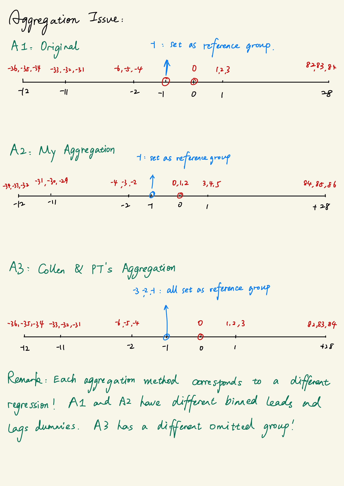

In particular, in the VM method, 
> In the regression, the only reference group is month -1.
>
> ...
> 
> quarter -2 estimate is average month -6, -5, -4 estimates
>
> quarter -1 estimate is month -1 estimates, which is 0 mechanically
> 
> quarter 0 estimate is month 0 estimate
> 
> quarter 1 estimate is average month 1, 2, 3 estimates
>
> ...
>
The problem in VM aggregation is not month -3, and -2 estimated are never presented.

In the WZ method,
> In the regression, the only reference group is month -1.
> 
> ...
> 
> quarter -2 quarter estimate is average months -2, -3, -4 estimates 
>
> quarter -1 estimate is month -1 estimates, which is 0 mechanically
> 
> quarter 0 estimate is average months 0, 1, 2 estimates 
> 
> quarter 1 estimate is average month 3, 4, 5 estimates
>
> ...
> 
The problem in WZ aggregation is that the quarter indices are a a little weird. 

In the CP method, 
> In the regression, the reference group includes months -1, -2, -3.
> 
> ...
> 
> quarter -2 quarter estimate is average months -4, -5, -6 estimates 
>
> quarter -1 estimate is average months -1, -2, -3, which is 0 mechanically
> 
> quarter 0 estimate is month 0 estimate  
> 
> quarter 1 estimate is average month 1, 2, 3 estimates
>
> ...
>
**By omitting three month groups in the month-level regressions, this aggregation method ensures that quarter -1 estimate is always zero.** By setting quarter 0 as month 0, this aggregation method have natural post-event quarter indices. However, for the sake of identification, we actually only need to omit 1 month group. I am not quite sure if setting three-months prior to the event as the reference group is plausible in all event-study settings.

Another point is that the three aggregation methods have different underlying month-level regressions. 

# 3. Panel A, B, and D of Figure 3

## 3.1. Regressions for Each Aggregation Method and Sample

The regressions for these panels are quite clear. In the follwing, $\mathbb{I}$ is the indicator function, $K$ is the relative time to the corresponding event.

For the VM method, the regression is 
$$
\begin{aligned}
    Y_{it} = \alpha_i + \lambda_t  & + \beta_{LtoH}^{<-36} \mathbb{I}_{i}\{LtoH\}\times \mathbb{I}_{it}\{K_{LtoH} < {\color{red} -36} \} \\
    & + \sum_{s={\color{red} -36}}^{{\color{red} -2}} \beta_{LtoH}^s \mathbb{I}_{i}\{LtoH\}\times \mathbb{I}_{it}\{K_{LtoH} = s \} \\
    & + \sum_{s=0}^{{\color{red} 84}} \beta_{LtoH}^s \mathbb{I}_{i}\{LtoH\}\times \mathbb{I}_{it}\{K_{LtoH} = s \} \\
    & + \beta_{LtoH}^{>84} \mathbb{I}_{i}\{LtoH\}\times \mathbb{I}_{it}\{K_{LtoH} > {\color{red} 84} \} \\
    & + \beta_{LtoL}^{<-36} \mathbb{I}_{i}\{LtoL\}\times \mathbb{I}_{it}\{K_{LtoL} < {\color{red} -36} \} \\
    & + \sum_{s={\color{red} -36}}^{{\color{red} -2}} \beta_{LtoL}^s \mathbb{I}_{i}\{LtoL\}\times \mathbb{I}_{it}\{K_{LtoL} = s \} \\
    & + \sum_{s=0}^{{\color{red} 84}} \beta_{LtoL}^s \mathbb{I}_{i}\{LtoL\}\times \mathbb{I}_{it}\{K_{LtoL} = s \} \\
    & +\beta_{LtoL}^{>84}  \mathbb{I}_{i}\{LtoL\}\times \mathbb{I}_{it}\{K_{LtoL} > {\color{red} 84} \}   + \epsilon_{it}
\end{aligned}
$$

For the WZ method, the regression is 
$$
\begin{aligned}
    Y_{it} = \alpha_i + \lambda_t  & + \beta_{LtoH}^{<-34} \mathbb{I}_{i}\{LtoH\}\times \mathbb{I}_{it}\{K_{LtoH} < {\color{red} -34} \} \\
    & + \sum_{s={\color{red} -34}}^{{\color{red} -2}} \beta_{LtoH}^s \mathbb{I}_{i}\{LtoH\}\times \mathbb{I}_{it}\{K_{LtoH} = s \} \\
    & + \sum_{s=0}^{{\color{red} 86}} \beta_{LtoH}^s \mathbb{I}_{i}\{LtoH\}\times \mathbb{I}_{it}\{K_{LtoH} = s \} \\
    & + \beta_{LtoH}^{>86} \mathbb{I}_{i}\{LtoH\}\times \mathbb{I}_{it}\{K_{LtoH} > {\color{red} 86} \} \\
    & + \beta_{LtoL}^{<-34} \mathbb{I}_{i}\{LtoL\}\times \mathbb{I}_{it}\{K_{LtoL} < {\color{red} -34} \} \\
    & + \sum_{s={\color{red} -34}}^{{\color{red} -2}} \beta_{LtoL}^s \mathbb{I}_{i}\{LtoL\}\times \mathbb{I}_{it}\{K_{LtoL} = s \} \\
    & + \sum_{s=0}^{{\color{red} 86}} \beta_{LtoL}^s \mathbb{I}_{i}\{LtoL\}\times \mathbb{I}_{it}\{K_{LtoL} = s \} \\
    & +\beta_{LtoL}^{>86}  \mathbb{I}_{i}\{LtoL\}\times \mathbb{I}_{it}\{K_{LtoL} > {\color{red} 86} \}   + \epsilon_{it}
\end{aligned}
$$

For the CP method, the regression is 
$$
\begin{aligned}
    Y_{it} = \alpha_i + \lambda_t  & + \beta_{LtoH}^{<-36} \mathbb{I}_{i}\{LtoH\}\times \mathbb{I}_{it}\{K_{LtoH} < {\color{red} -36} \} \\
    & + \sum_{s={\color{red} -36}}^{{\color{red} -4}} \beta_{LtoH}^s \mathbb{I}_{i}\{LtoH\}\times \mathbb{I}_{it}\{K_{LtoH} = s \} \\
    & + \sum_{s=0}^{{\color{red} 84}} \beta_{LtoH}^s \mathbb{I}_{i}\{LtoH\}\times \mathbb{I}_{it}\{K_{LtoH} = s \} \\
    & + \beta_{LtoH}^{>84} \mathbb{I}_{i}\{LtoH\}\times \mathbb{I}_{it}\{K_{LtoH} > {\color{red} 84} \} \\
    & + \beta_{LtoL}^{<-36} \mathbb{I}_{i}\{LtoL\}\times \mathbb{I}_{it}\{K_{LtoL} < {\color{red} -36} \} \\
    & + \sum_{s={\color{red} -36}}^{{\color{red} -2}} \beta_{LtoL}^s \mathbb{I}_{i}\{LtoL\}\times \mathbb{I}_{it}\{K_{LtoL} = s \} \\
    & + \sum_{s=0}^{{\color{red} 84}} \beta_{LtoL}^s \mathbb{I}_{i}\{LtoL\}\times \mathbb{I}_{it}\{K_{LtoL} = s \} \\
    & +\beta_{LtoL}^{>84}  \mathbb{I}_{i}\{LtoL\}\times \mathbb{I}_{it}\{K_{LtoL} > {\color{red} 84} \}   + \epsilon_{it}
\end{aligned}
$$

The sample in the regressions are consisting of only three types of workers:
1. **all** control workers, who didn't experience a manager change (this is a little different from the original regressions);
2. workers who experienced a LtoL manager change and both involving managers are WL2;
3. workers who experienced a LtoH manager change and both involving managers are WL2.

In Stata, the logical condition is like the following.

`if ((Mngr_both_WL2==1 & (FT_LtoL==1 | FT_LtoH==1)) | (Never_ChangeM==1))`

## 3.2. Description of Files

The "0201CoefPrograms_Figure3_PanelABD.do" stores six programs. For each aggregation routine, there is one program with an example name `LH_minus_LL_VM` calculating $\beta_{LtoH}^s - \beta_{LtoL}^s$, and then aggregating monthly coefficients to quarter levels using the corresponding aggregation method. There is another program with an example name `pretrend_LH_minus_LL_VM` calculating the pretrend $p$-value.

In "0301Figure3_PanelABD.do" file, I first create a simplied dataset with event dummies created by myself (see the variable construction process in the next Section), then I replicate Panels A, B, and D of Figure 3 using three aggregation methods.

**It took me about 1.5h to create all of the 12 figures.**

## 3.3. Practical Issue 1: Variable Name Issues

Since I need to code another two quarter aggregation programs, I need to have a very clear understanding of the variables. Current variables names are sometimes quite vague, and I have trouble finding the original codes to create the "event $\times$ relative period" dummies (which, I believe, are named like `F0ELH` and `L0ELH`). My strategy is to use the minimum information from the existing dataset, and create my own "event $\times$ relative period" dummies used in regressions. **The starting point of my variable construction is the following four variables: `FTLL` `FTLH` `FTHL` `FTHH`.** 

From my understanding, these four variables document the event time for each possbile manager change. If all four variables have missing values, then the worker is a control group who didn't experience a manager change. 

The most important variable construction commands (and I am not so sure if I am doing right) are in s1_2 and s1_3 in the "0301Figure3_PanelABD.do" file, which are copied below,

```
*-?*-?*-?*-?*-?*-?*-?*-?*-?*-?*-?*-?*-?*-?*-?*-?*-?*-?*-?*-?*-?*-?*-?*-?*-?
*-? s1_2. construct (individual level) event dummies 
*-?       and (individual-month level) relative dates to the event
*-?*-?*-?*-?*-?*-?*-?*-?*-?*-?*-?*-?*-?*-?*-?*-?*-?*-?*-?*-?*-?*-?*-?*-?*-?

*!! calendar time of the event
rename FTLL Calend_Time_FT_LtoL
rename FTLH Calend_Time_FT_LtoH
rename FTHL Calend_Time_FT_HtoL
rename FTHH Calend_Time_FT_HtoH

*!! five event dummies: 4 types of treatment + 1 never-treated
generate FT_LtoL = 0 
replace  FT_LtoL = 1 if Calend_Time_FT_LtoL != .

generate FT_LtoH = 0 
replace  FT_LtoH = 1 if Calend_Time_FT_LtoH != .

generate FT_HtoL = 0 
replace  FT_HtoL = 1 if Calend_Time_FT_HtoL != .

generate FT_HtoH = 0 
replace  FT_HtoH = 1 if Calend_Time_FT_HtoH != .

capture drop temp 
egen temp = rowtotal(FT_LtoL FT_LtoH FT_HtoL FT_HtoH)
generate Never_ChangeM = 1 - temp 
capture drop temp

label variable FT_LtoL "=1, if the worker experiences a low- to low-type manager change"
label variable FT_LtoH "=1, if the worker experiences a low- to high-type manager change"
label variable FT_HtoL "=1, if the worker experiences a high- to low-type manager change"
label variable FT_HtoH "=1, if the worker experiences a high- to high-type manager change"
label variable Never_ChangeM "=1, if the worker never experiences a manager change"

*!! relative date to the event 
generate Rel_Time = . 
replace  Rel_Time = YearMonth - Calend_Time_FT_LtoL if Calend_Time_FT_LtoL !=. 
replace  Rel_Time = YearMonth - Calend_Time_FT_LtoH if Calend_Time_FT_LtoH !=. 
replace  Rel_Time = YearMonth - Calend_Time_FT_HtoL if Calend_Time_FT_HtoL !=. 
replace  Rel_Time = YearMonth - Calend_Time_FT_HtoH if Calend_Time_FT_HtoH !=. 

label variable Rel_Time "relative date to the event, missing if the event is Never_ChangeM"
```
```
*-?*-?*-?*-?*-?*-?*-?*-?*-?*-?*-?*-?*-?*-?*-?*-?*-?*-?*-?*-?*-?*-?*-?*-?*-?
*-? s1_3. construct "event * relative date" dummies 
*-?*-?*-?*-?*-?*-?*-?*-?*-?*-?*-?*-?*-?*-?*-?*-?*-?*-?*-?*-?*-?*-?*-?*-?*-?
summarize Rel_Time, detail // range: [-131, +130]

*!! ordinary "event * relative date" dummies 

local max_pre_period  = 36 
local max_post_period = 86

foreach event in FT_LtoL FT_LtoH FT_HtoL FT_HtoH {
    forvalues time = 1/`max_pre_period' {
        generate byte `event'_X_Pre`time' = `event' * (Rel_Time == -`time')
    }
}
foreach event in FT_LtoL FT_LtoH FT_HtoL FT_HtoH {
    forvalues time = 0/`max_post_period' {
        generate byte `event'_X_Post`time' = `event' * (Rel_Time == `time')
    }
}

*!! binned absorbing "event * relative date" dummies for pre- and post-event periods 

foreach event in FT_LtoL FT_LtoH FT_HtoL FT_HtoH {
    generate byte `event'_X_Pre_Before36 = `event' * (Rel_Time < -36)
}

foreach event in FT_LtoL FT_LtoH FT_HtoL FT_HtoH {
    generate byte `event'_X_Pre_Before34 = `event' * (Rel_Time < -34)
}

foreach event in FT_LtoL FT_LtoH FT_HtoL FT_HtoH {
    generate byte `event'_X_Post_After86 = `event' * (Rel_Time > 86)
}

foreach event in FT_LtoL FT_LtoH FT_HtoL FT_HtoH {
    generate byte `event'_X_Post_After84 = `event' * (Rel_Time > 84)
}

```

## 3.4. Programs to Aggregate the Monthly Coefficients

To reduce space here, I won't copy the programs in "0201CoefPrograms_Figure3_PanelABD.do" file. I have double checked all the programs, but still **it may be better if you can review the codes**. I have tried to make the name of every local macro as informative as possible.  

## 3.5. Results 

One-sentence summary: It seems that the aggregation methods don't matter so much. 

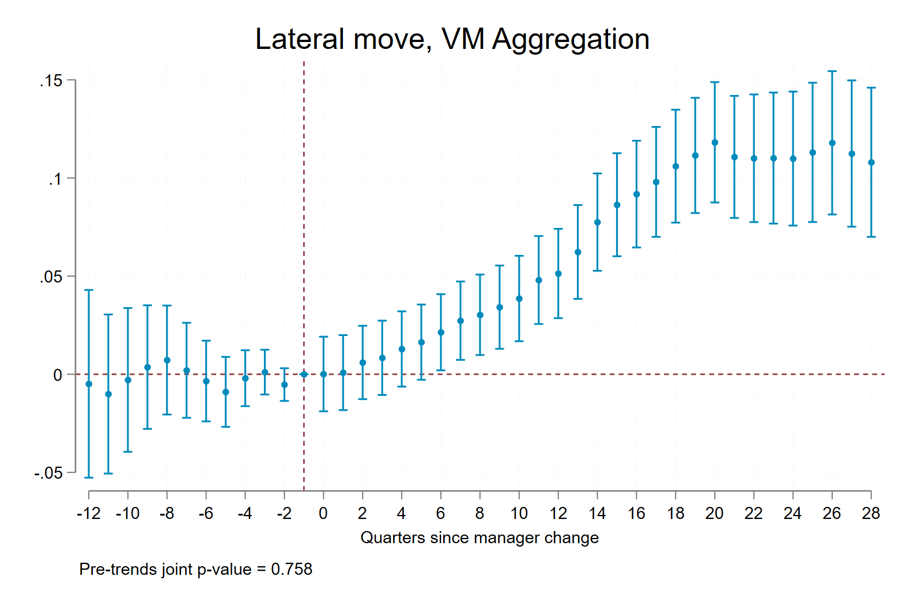

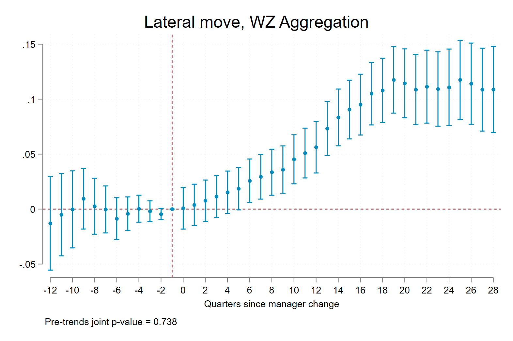

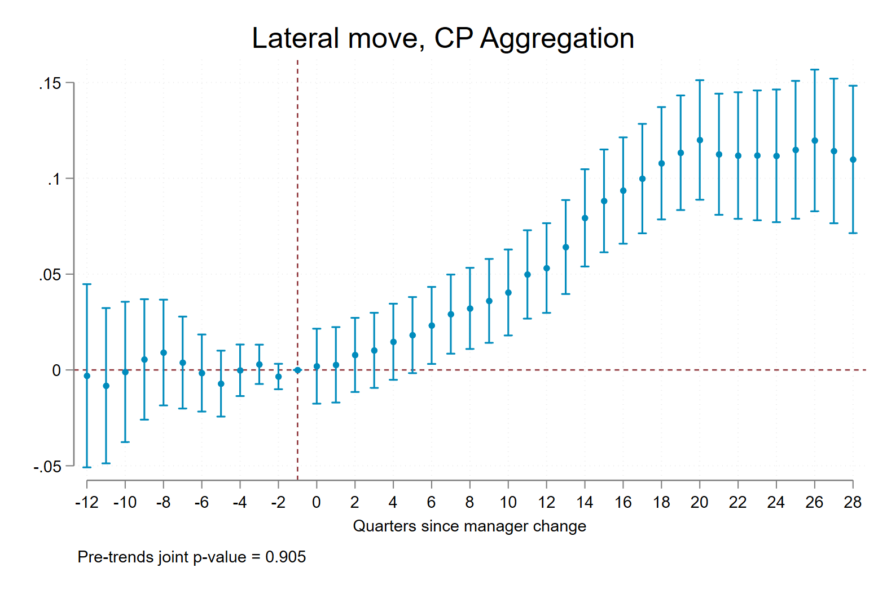

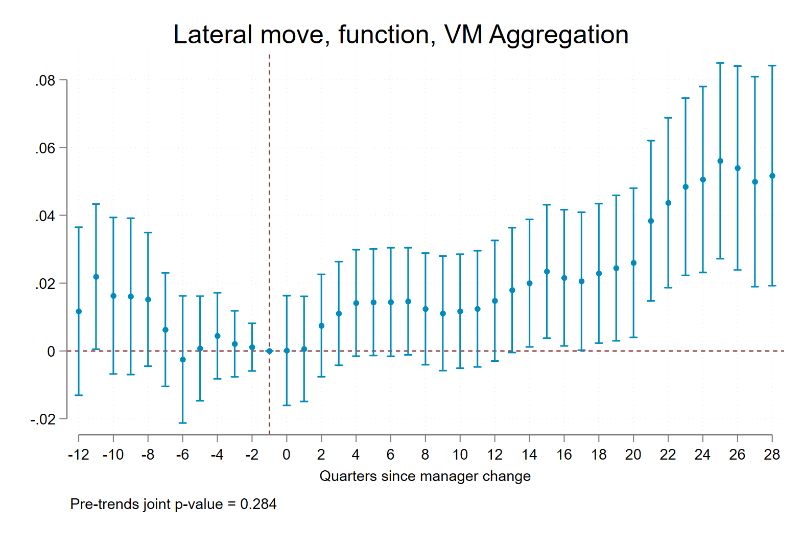


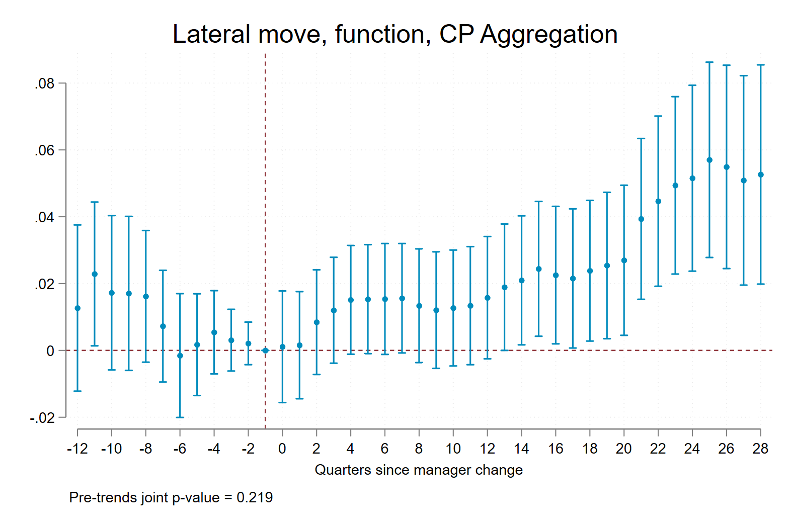

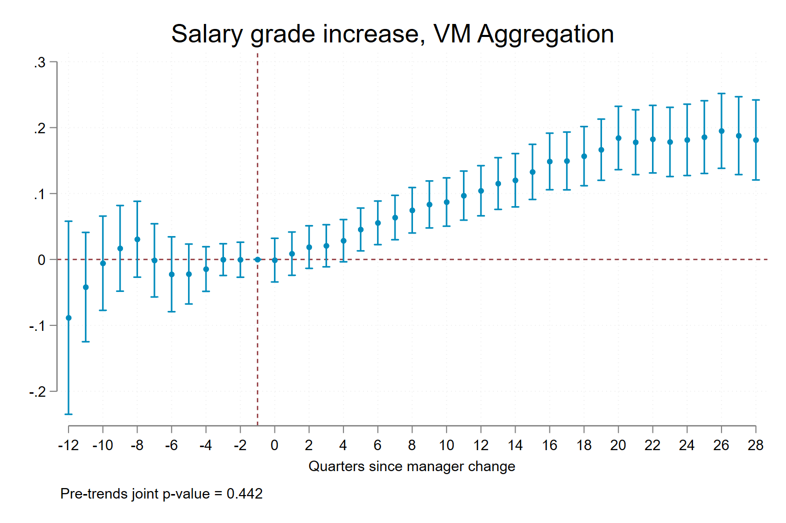

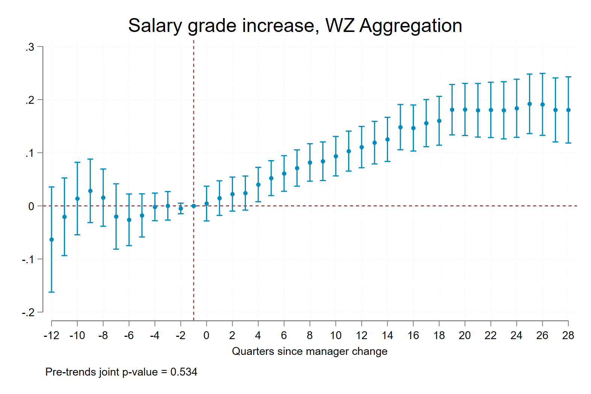

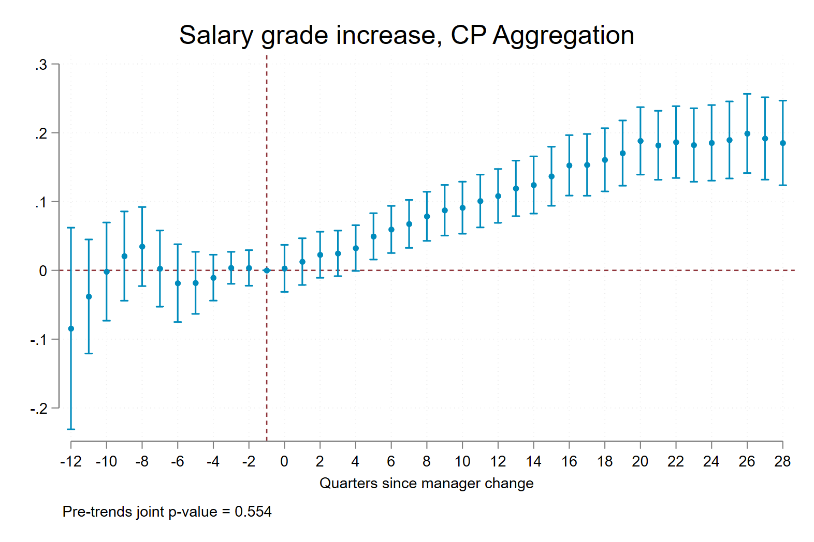

# 4. Panel C of Figure 3

## 4.1. Regression and Sample (I am NOT sure)

In my opinion, the regression should be something like:
$$
\begin{aligned}
    Y_{it} = \alpha X_{it} & + \sum_{s=0}^{{\color{red} 84}} \beta_{LtoH}^s \mathbb{I}_{i}\{LtoH\}\times \mathbb{I}_{it}\{K_{LtoH} = s \} \\
    & + \beta_{LtoH}^{>84} \mathbb{I}_{i}\{LtoH\}\times \mathbb{I}_{it}\{K_{LtoH} > {\color{red} 84} \} \\
    & + \sum_{s=0}^{{\color{red} 84}} \beta_{LtoL}^s \mathbb{I}_{i}\{LtoL\}\times \mathbb{I}_{it}\{K_{LtoL} = s \} \\
    & +\beta_{LtoL}^{>84}  \mathbb{I}_{i}\{LtoL\}\times \mathbb{I}_{it}\{K_{LtoL} > {\color{red} 84} \}   + \epsilon_{it}
\end{aligned}
$$

And the sample in this regression should include only three types of workers:
1. **all** control workers, who didn't experience a manager change (this is a little different from the original regressions);
2. workers who experienced a LtoL manager change and both involving managers are WL2;
3. workers who experienced a LtoH manager change and both involving managers are WL2.

Since our outcome variable is time-invariant -- each worker is either a leaver or not. Which periods should be included in the regression is kind of tricky here. I think we should add all post-event periods, with (relative) month 0 as the reference group. 

However, the original regression is the following, which is not the same as my expectation.

```
eststo: reghdfe LeaverPerm $event  if KEi>-1 & WL2==1 & cohort30==1 , a( Office##Func##YearMonth  AgeBand##Female   ) vce(cluster IDlseMHR)
```
- The macro is defined as `global event $LExitLH  $LExitLL  $LExitHL  $LExitHH`, which include all four types of treatment, which I think, to be consistent with the other three panels in this figure, we should drop the HtoH and HtoL treatment groups. 
- The logical condition `WL2==1` excludes all control workers, so in the original regression, we didn't include the control group.
- `KEi>-1` basically makes sure our sample only include post-event periods. But when I investigate this variable carefully, I find that some control workers actually have non-mssing `KEi` values. I wonder what this variable really means. Is my current event dummy contruction wrong?
- Similarly, variable `cohort30` is defined by `generate cohort30 = 1 if Ei >=tm(2014m1) & Ei <=tm(2018m12)`, and `Ei` can be $1$ for some control workers. This again raised my doubt about using the set of variables `FTLL` `FTLH` `FTHL` `FTHH` as my starting point.

I decided to run two regressions -- one using the same sample restriction variables but with my own "event $\times$ relative period" dummies, the other one use my own "event $\times$ relative period" dummies and include all control workers, like the following two commands:
```
reghdfe LeaverPerm ${eventsXreltime_dummies} ///
    if (Mngr_both_WL2==1) & KEi > -1 & cohort30==1 ///
    , absorb(Office##Func##YearMonth  AgeBand##Female) vce(cluster IDlseMHR)

reghdfe LeaverPerm ${eventsXreltime_dummies} ///
    if (Mngr_both_WL2==1 | Never_ChangeM==1) & KEi > -1 & cohort30==1 ///
    , absorb(Office##Func##YearMonth  AgeBand##Female) vce(cluster IDlseMHR)
```
**I didn't include the HtoH and HtoL treatment groups in both regressions, so they are different from the original regression.**

**And I didn't change the sample restriction variables, but I think it may be a good idea to distinguish between these event-related variables with other variables.**

Maybe we should discuss more about this regression. This event-study analysis is a little tricky as the outcome variable is $Y_{i}$ rather than $Y_{it}$. I don't have too much experience to deal with this kind of regressions.

## 4.2. Results 

With Control Workers

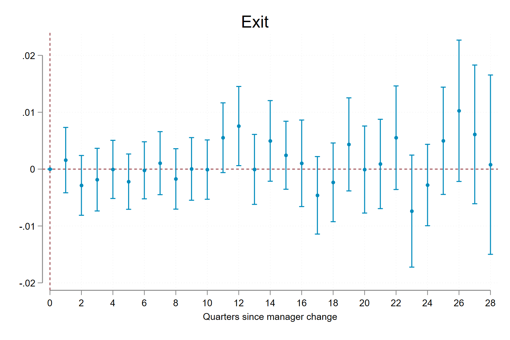

Without Control Workers

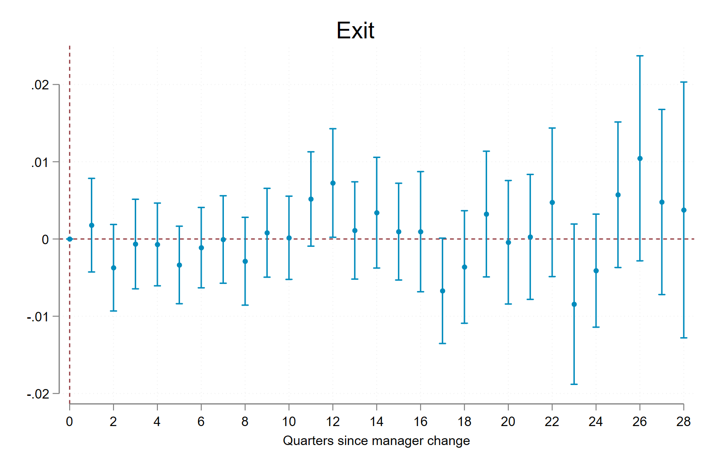


