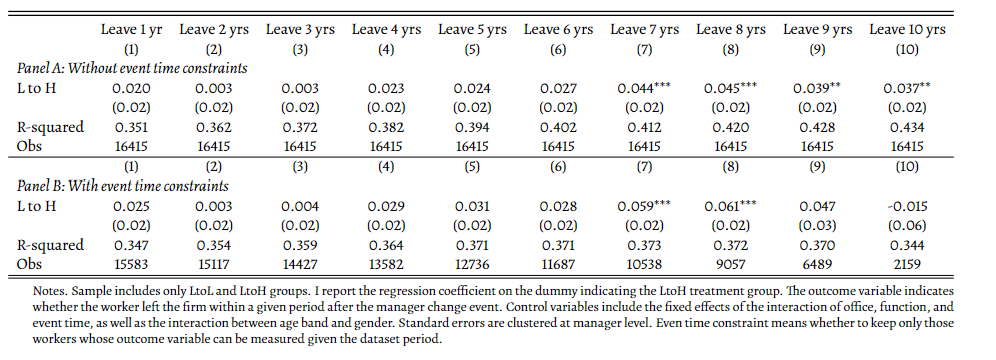
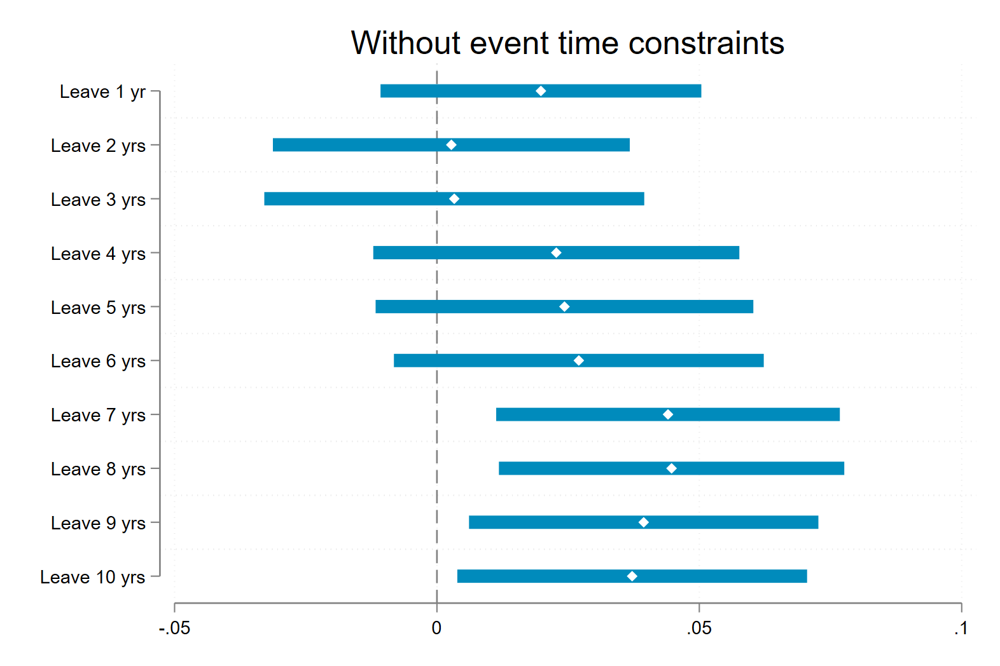
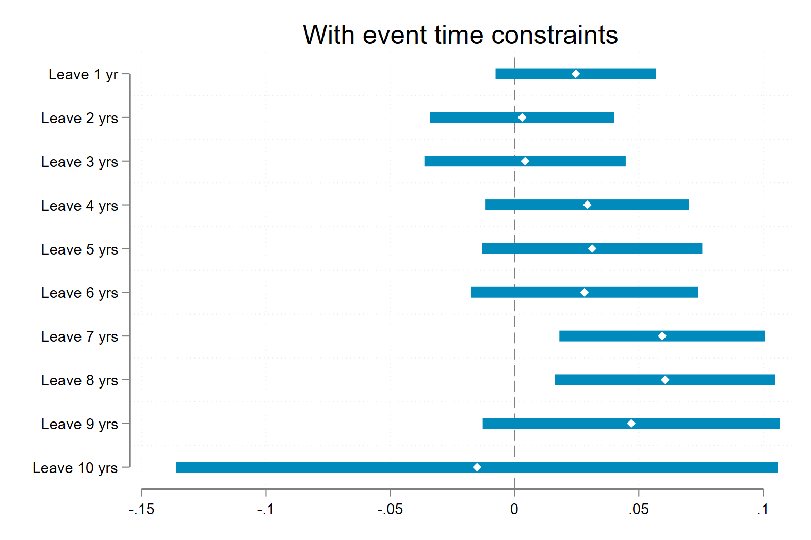

# 1. Task Description 
1. Modify the event-study analysis on exit outcomes to a cross-sectional regression. 

# 2. Construct Outcome Variables

The outcome variables are "whether the worker left the firm within a given period of time after the event". The following are the key Stata codes that I used to construct the outcome variables. First, I identify those leavers using the variable `LeaverPerm`. Next, I identify their last time appearing in the dataset as their `Leave_Time`. Then, I construct the `Rel_Leave_Time` variable measuring the period between event time and leaving time. Finally, I am able to construct the desired outcome variables. 

```
*-?*-?*-?*-?*-?*-?*-?*-?*-?*-?*-?*-?*-?*-?*-?*-?*-?*-?*-?*-?*-?*-?*-?*-?*-?
*-? s1_3. time when leaving the firm
*-?*-?*-?*-?*-?*-?*-?*-?*-?*-?*-?*-?*-?*-?*-?*-?*-?*-?*-?*-?*-?*-?*-?*-?*-?

sort IDlse YearMonth

bysort IDlse: egen Leaver = max(LeaverPerm)

bysort IDlse: egen temp = max(YearMonth)
generate Leave_Time = . 
replace  Leave_Time = temp if Leaver == 1
format Leave_Time %tm
drop temp

generate Rel_Leave_Time = Leave_Time - Event_Time

order IDlse YearMonth LeaverPerm Leaver Leave_Time Event_Time Rel_Leave_Time

label variable Leaver "=1, if the worker left the firm during the dataset period"
label variable Leave_Time "Time when the worker left the firm, missing if he stays during the sample period"
label variable Rel_Leave_Time "Leave_Time - Event_Time"

*-?*-?*-?*-?*-?*-?*-?*-?*-?*-?*-?*-?*-?*-?*-?*-?*-?*-?*-?*-?*-?*-?*-?*-?*-?
*-? s1_4. outcome variables
*-?*-?*-?*-?*-?*-?*-?*-?*-?*-?*-?*-?*-?*-?*-?*-?*-?*-?*-?*-?*-?*-?*-?*-?*-?

generate Leave_1yr   = inrange(Rel_Leave_Time, 0, 12)
generate Leave_2yrs  = inrange(Rel_Leave_Time, 0, 24)
generate Leave_3yrs  = inrange(Rel_Leave_Time, 0, 36)
generate Leave_4yrs  = inrange(Rel_Leave_Time, 0, 48)
generate Leave_5yrs  = inrange(Rel_Leave_Time, 0, 60)
generate Leave_6yrs  = inrange(Rel_Leave_Time, 0, 72)
generate Leave_7yrs  = inrange(Rel_Leave_Time, 0, 84)
generate Leave_8yrs  = inrange(Rel_Leave_Time, 0, 96)
generate Leave_9yrs  = inrange(Rel_Leave_Time, 0, 108)
generate Leave_10yrs = inrange(Rel_Leave_Time, 0, 120)
```

# 2. The Regression I run 

First, I make the following sample restrictions. I keep only LtoL and LtoH treatment groups (no control workers in the regression sample), and I keep only one observation for each worker (`keep if YearMonth == Event_Time`) and ensures that the I am using control variables at the time of treatment.

```
keep if (FT_LtoL==1) | (FT_LtoH==1) 
    //&& keep only LtoL and LtoH groups
keep if YearMonth == Event_Time 
    //&& keep one observation for one worker, 
    //&& this also ensures we are using control variables at the time of treatment
keep if Mngr_both_WL2 == 1
    //&& usual sample restriction
```
Second, following the original regression in the event-study, I run the following regressions, controlling for office, function, event time, age, and gender:

```
global exit_outcomes Leave_1yr Leave_2yrs Leave_3yrs Leave_4yrs Leave_5yrs Leave_6yrs Leave_7yrs Leave_8yrs Leave_9yrs Leave_10yrs

foreach var in $exit_outcomes {
    reghdfe `var' FT_LtoH, absorb(Office##Func##Event_Time AgeBand##Female) vce(cluster IDlseMHR)

    eststo `var'
}
```

However, one key issue is that if the event time is so late, we may not be able to observe, say, whether they left the firm within 10 years after the treatment. For example, if the event happened in 2015-12, since our latest period is 2021-12, we cannot tell if he left the firm within 10 years, but in the above method, they are classified as not. 

To overcome this issue, it is important to impose restrictions on the event time. Specifically, here is what I do:

```
summarize Event_Time, detail // max: 743
global LastMonth = r(max)

global exit_outcomes Leave_1yr Leave_2yrs Leave_3yrs Leave_4yrs Leave_5yrs Leave_6yrs Leave_7yrs Leave_8yrs Leave_9yrs Leave_10yrs
local i = 1
foreach var in $exit_outcomes {

    global LastPossibleEventTime = ${LastMonth} - 12 * `i'

    reghdfe `var' FT_LtoH if Event_Time <= ${LastPossibleEventTime}, absorb(Office##Func##Event_Time AgeBand##Female) vce(cluster IDlseMHR)

    eststo `var'_TC

    local i  = `i' + 1
}
```
The sample restriction condition `if Event_Time <= ${LastPossibleEventTime}` matters a lot as it will decrease the sample size, and results between these two sets of regressions are different. 

# 3. Results 





