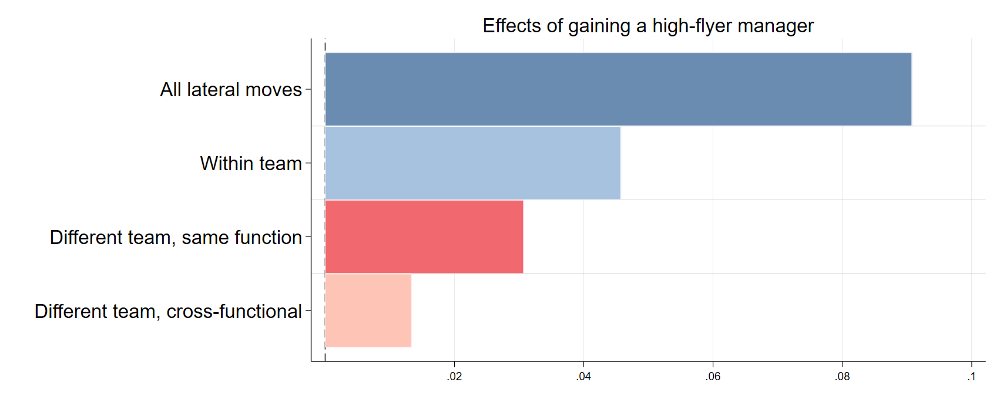
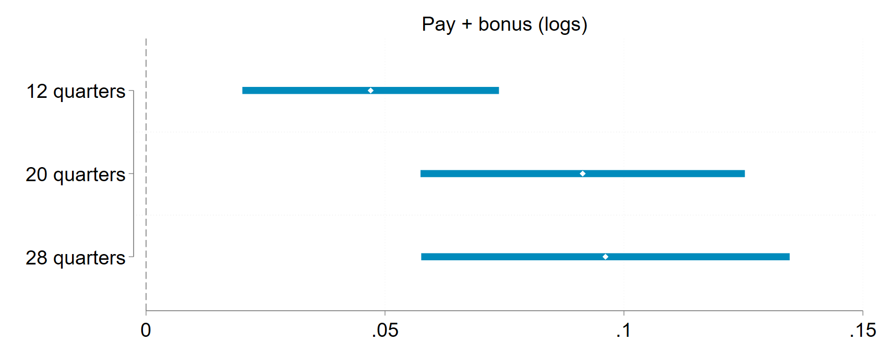
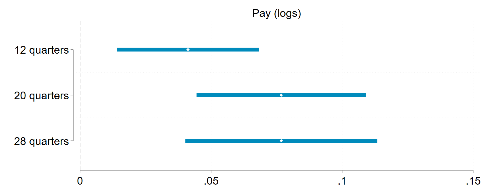
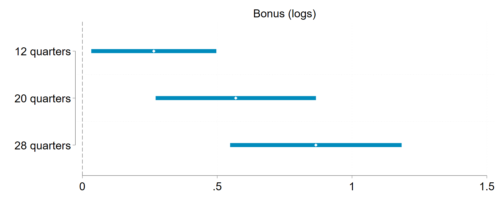
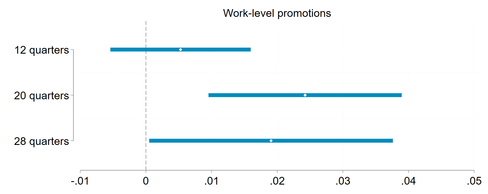

# 1. Task Description 
1. Replicate Figure 4 and 5 in the paper.

# 2. Figure 4

## 2.1. The Original Regression

The original regression uses only 6 month periods: Month -1, -2, -3, and Month -22, -23, -24. In contrast, it uses all four treatment groups. In particular, relevant Stata codes are

```
foreach var in  TransferSJC TransferSJSameMSameFuncC TransferSJDiffMSameFuncC TransferFuncC {
	reghdfe   `var' `Label'LHPost  `Label'HLPost  `Label'HHPost `Label'LLPost if (WL2==1 ) & (  KEi ==-1 | KEi ==-2 | KEi ==-3  | KEi ==22 | KEi ==23 | KEi ==24 ) , a(  IDlse YearMonth ) vce(cluster IDlseMHR)

    xlincom  (`Label'LHPost  - `Label'LLPost ) (`Label'HLPost  - `Label'HHPost) , level(95) post
    est store  `var'

}
```

## 2.2. My Regression

To keep consistent with Figure 3, **I use only two treatment groups: LtoL and LtoH (and also all control workers), but all periods**. In particular, my relevant Stata codes are 

```
foreach var in TransferSJC TransferSJSameMSameFuncC TransferSJDiffMSameFuncC TransferFuncC {
    reghdfe `var' ${events_LH_minus_LL} ///
        if ((Mngr_both_WL2==1 & (FT_LtoL==1 | FT_LtoH==1)) | (Never_ChangeM==1)) ///
        , absorb(IDlse YearMonth)  vce(cluster IDlseMHR) 
    
    *&& Quarter 8th estimate = the average of Month 22, Month 23, and Month 24 estimates
    xlincom (((FT_LtoH_X_Post22 - FT_LtoL_X_Post22) + (FT_LtoH_X_Post23 - FT_LtoL_X_Post23) + (FT_LtoH_X_Post24 - FT_LtoL_X_Post24))/3), level(95) post

    eststo `var'
}
```
where the macro `${events_LH_minus_LL}` stores macros `FT_LtoL_X_Pre_Before36 FT_LtoL_X_Pre36 ... FT_LtoL_X_Pre4 FT_LtoL_X_Post0 FT_LtoL_X_Post1 ... FT_LtoL_X_Post84 FT_LtoL_X_Pre_After84` and `FT_LtoH_X_Pre_Before36 FT_LtoH_X_Pre36 ... FT_LtoH_X_Pre4 FT_LtoH_X_Post0 FT_LtoH_X_Post1 ... FT_LtoH_X_Post84 FT_LtoH_X_Pre_After84`. Again, to keep consistent with Figure 3, **I omit Month -1, -2, and -3 as reference groups**, even though we don't need a whole series of quarter aggregated estimates.

## 2.3. Results




# 3. Figure 5 

## 3.1. The Original Regression 

I think we run the same regression, but I don't think the original codes aggregate monthly estimates to quarterly estimates. In particular, relevant codes are 

```
xlincom (L36ELH - L36ELL) (L60ELH - L60ELL) (L84ELH - L84ELL) (L24ELH - L24ELL) , level(95) post
est store LogPay
 
coefplot  ///
    (LogPay, keep(lc_1) rename(  lc_1  = "12 quarters") ciopts(lwidth(2 ..) lcolor(ebblue)))  ///
    (LogPay, keep(lc_2) rename(  lc_2  = "20 quarters") ciopts(lwidth(2 ..) lcolor(ebblue)))  ///
    (LogPay, keep(lc_3) rename(  lc_3  = "28 quarters") ciopts(lwidth(2 ..) lcolor(ebblue)) )  ///
    , ciopts(lwidth(2 ..))  msymbol(d) mcolor(white) aspect(0.4) legend(off) levels(95)  ///
    title("`lab'", size(medsmall))  xline(0, lpattern(dash))  xlabel(0(0.1)0.4) xscale(range(0 0.4))
```

## 3.2. My Codes

Again, to keep consistent with Figure 3, I use **I use only two treatment groups: LtoL and LtoH (and also all control workers), but all periods**. Unlike the original codes, **I report the average of the three corresponding monthly estimates**. For example, for panel A,

```

reghdfe LogPayBonus ${events_LH_minus_LL} ///
    if ((Mngr_both_WL2==1 & (FT_LtoL==1 | FT_LtoH==1)) | (Never_ChangeM==1)) ///
    , absorb(IDlse YearMonth)  vce(cluster IDlseMHR) 

*&& Quarter 12 estimate is the average of Month 34, Month 35, and Month 36 estimates
*&& Quarter 20 estimate is the average of Month 58, Month 59, and Month 60 estimates
*&& Quarter 28 estimate is the average of Month 82, Month 83, and Month 84 estimates

xlincom ///
    (((FT_LtoH_X_Post34 - FT_LtoL_X_Post34) + (FT_LtoH_X_Post35 - FT_LtoL_X_Post35) + (FT_LtoH_X_Post36 - FT_LtoL_X_Post36))/3) ///
    (((FT_LtoH_X_Post58 - FT_LtoL_X_Post58) + (FT_LtoH_X_Post59 - FT_LtoL_X_Post59) + (FT_LtoH_X_Post60 - FT_LtoL_X_Post60))/3) ///
    (((FT_LtoH_X_Post82 - FT_LtoL_X_Post82) + (FT_LtoH_X_Post83 - FT_LtoL_X_Post83) + (FT_LtoH_X_Post84 - FT_LtoL_X_Post84))/3) ///
    , level(95) post

eststo LogPayBonus

coefplot  ///
    (LogPayBonus, keep(lc_1) rename(lc_1 = "12 quarters") ciopts(lwidth(2 ..) lcolor(ebblue)))  ///
    (LogPayBonus, keep(lc_2) rename(lc_2 = "20 quarters") ciopts(lwidth(2 ..) lcolor(ebblue)))  ///
    (LogPayBonus, keep(lc_3) rename(lc_3 = "28 quarters") ciopts(lwidth(2 ..) lcolor(ebblue)))  ///
    , ciopts(lwidth(2 ..)) levels(95) msymbol(d) mcolor(white) legend(off)  ///
    title("Pay + bonus (logs)", size(vlarge)) ///
    graphregion(margin(medium)) plotregion(margin(medium)) xsize(5) ysize(2) ///
    xline(0, lpattern(dash)) ylabel(, labsize(vlarge)) xlabel(, labsize(vlarge))
```

## 3.3. Results 

**Current results are very different from the original ones.** I guess it is due to quarter aggregation issue, since we are essentially reporting different estimates.






